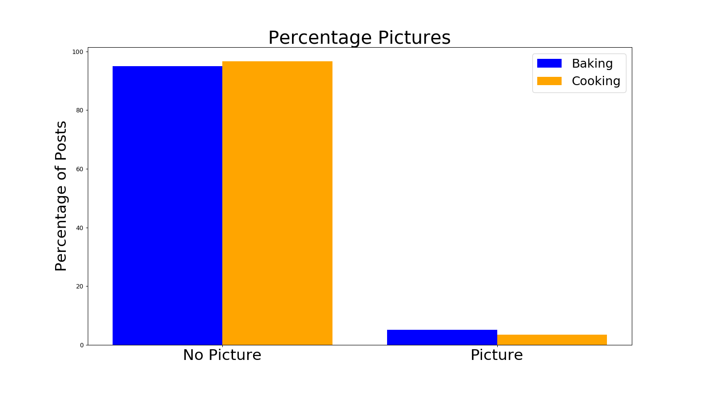
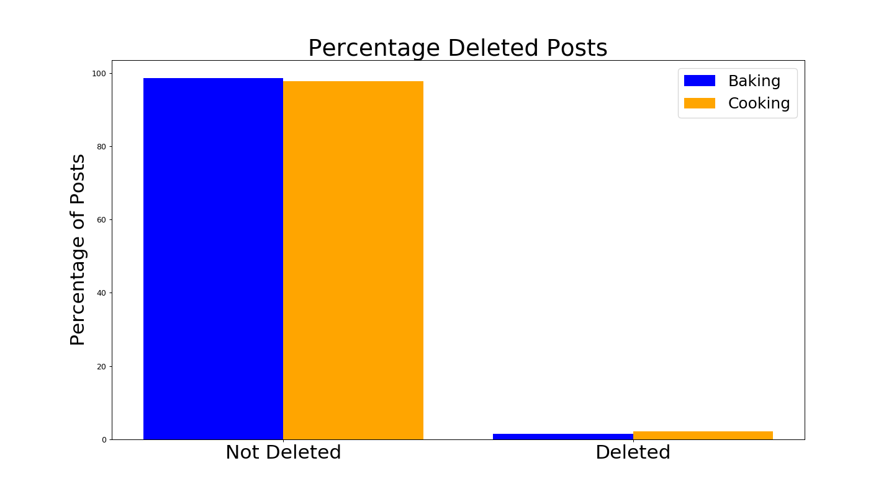
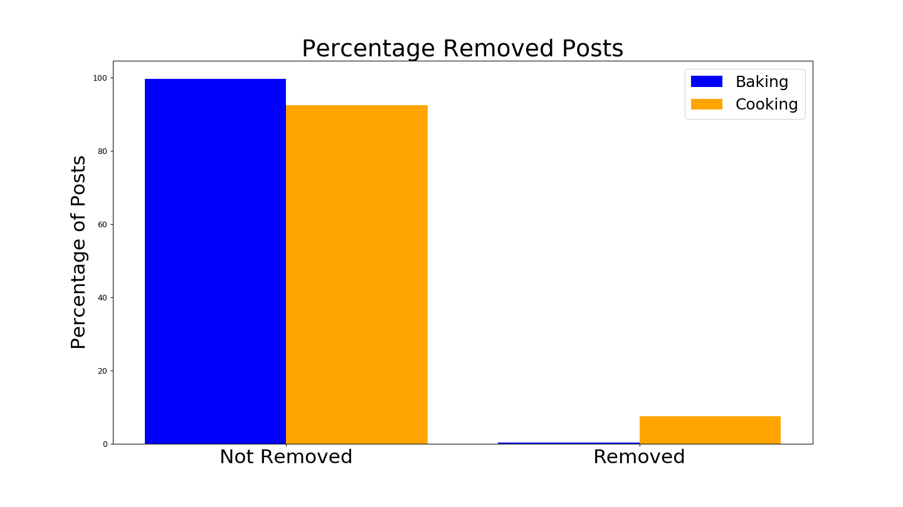

# Cooking vs Baking
### An Exploration of the Difference between Subreddits

We were tasked with comparing two subreddits with Natural Langauge Processing (NLP) and create a model to see if we could predict if a piece of text came from one subreddit or another.

### Table of Contents:
[Data](./Data/)  
[Jupyter Notebook](./Reddit_Final.ipynb)

## Problem statement

I choice to review the baking and cooking subreddits. These two subreddits are similar in that they both are about making food but I propose thier subject matter is different enought that we can build a model that compares them.

## The Data

I used the Pushshift API to gather the data. Pushshift ingests data from various social media companies such as Twitter and Reddit and makes that data available for researchers and academic institutions. They gather both submission and comment data. I created function that pulls the data from both.

### Baking
The baking subreddit has 218K Subscribers. When I was pulling from the pushshift API I was never able to pull more than 10,000 post no matter how many times I queried it, which leads me to believe that the subreddit has approximently that many posts. The submissions are mostly a title and picture and with more indepth discussion in the comments. I used 9,698 submissions, the submission data is both the title of the post and the photo or text of the post. I also gathered 9,496 comments

### Cooking
The baking subreddit has 1.039M Subscribers. I was able to pull more than 100k posts and I suspect that there are even more posts than that. This is a more active subreddit then the baking subreddit. In order to create a better classification model I choose to undersample the cooking subreddit. I pulled 24,472 submission posts and 24,448 comments.

|Feature|Type|Dataset|Description|                     
|---|---|---|---|
body|_Object_|cooking_comments_smaller.csv|Text of the comment
score|_Object_|cooking_comments_smaller.csv|Reddit Score of comment. This is numbers of upvotes a comment recieved minus number of downvotes
created_utc|*Object*|cooking_comments_smaller.csv|Raw date data reddit stores of when comment was created
timestamp|*Object*|cooking_comments_smaller.csv|Time stamp of comment creation
body|*Object*|baking_comments_smaller.csv|Text of the comment
score|*Object*|baking_comments_smaller.csv|Reddit Score of comment. This is numbers of upvotes a comment recieved minus number of downvotes
created_utc|*Object*|baking_comments_smaller.csv|Raw date data reddit stores of when comment was created
timestamp|*Object*|baking_comments_smaller.csv|Time stamp of comment creation
title   |        *object*|cooking_submissions_smaller.csv|Title of the reddit post
selftext|*        object*|cooking_submissions_smaller.csv|The body of the post
subreddit       |*object*|cooking_submissions_smaller.csv|Subreddit post came from
created_utc      |*int64*|cooking_submissions_smaller.csv|Raw date data reddit stores of when comment was created
author          |*object*|cooking_submissions_smaller.csv|Author of the post
num_comments     |*int64*|cooking_submissions_smaller.csv|Number of comments the post has
score            |*int64*|cooking_submissions_smaller.csv|Reddit Score of post. This is numbers of upvotes a post recieved minus number of downvotes
is_self           |*bool*|cooking_submissions_smaller.csv|Boolean that indicates whether is a duplicate
timestamp       |*object*|cooking_submissions_smaller.csv|Time stamp of post creation
title   |        *object*|baking_submissions_smaller.csv|Title of the reddit post
selftext|*        object*|baking_submissions_smaller.csv|The body of the post
subreddit       |*object*|baking_submissions_smaller.csv|Subreddit post came from
created_utc      |*int64*|baking_submissions_smaller.csv|Raw date data reddit stores of when comment was created
author          |*object*|baking_submissions_smaller.csv|Author of the post
num_comments     |*int64*|baking_submissions_smaller.csv|Number of comments the post has
score            |*int64*|baking_submissions_smaller.csv|Reddit Score of post. This is numbers of upvotes a post recieved minus number of downvotes
is_self           |*bool*|baking_submissions_smaller.csv|Boolean that indicates whether is a duplicate
timestamp       |*object*|baking_submissions_smaller.csv|Time stamp of post creation

### Comparing the Two

The baking subreddit had more pictures than the cooking subredit  

The cooking subreddit had more deleted and removed post than baking

## Natural Language Processing

I used the Term Frequency-Inverse Document Frequency (TF-IDF) to vectorize the text. I tested Count Frequency Vectorizer as well and found that TF-iDF created a better model. I did use the count vectorizer to create a list of stop words that were common words in both subreddits.

**New Stop Words**
add, good, like, look, make, try, use, want, recipe, think, thank, time, need, time, help, work, really, know

I tested TF-iDf with a number of different ngrams and max features and I found that a ngram range of 1-4 and 20,000 max features created the best model. I also lemmatized the words since I found when I reviewed the top words we were seeing instances of cook and cooking, as well as recipe and recipes. I first lemmatized using nouns as the based and then lemmatized using verbs as the base in order to catch both instances.

**Top Words after Stop Words removed**

**Baking**

|Word|Frequency|                     
|---|---|
cake|         14.931565
bake |        14.315174
chocolate|     5.564323
cooky     |    4.632482
love       |   4.258447
bread       |  4.085571
pie          | 3.673569
sugar         |3.484594
butter|        3.145238
cream  |       3.083878
flour   |      2.695615
dough    |     2.648519
mix       |    2.219289
egg        |   2.189933
cup         |  1.586343

**Cooking**

|Word|Frequency|                     
|---|---|
cook |      13.364831
chicken|     4.839531
food    |    4.601524
sauce    |   4.563306
eat       |  3.644702
way        | 3.587163
buy         |3.586749
pan   |      3.420908
dish   |     3.278404
meat    |    3.255789
taste    |   2.930906
oil       |  2.769730
egg        | 2.706554
fry         |2.670633
rice     |   2.617324

## Modeling

The dataset is is 71.7% cooking so this is our baseline score. I created a file that was the text from submissions and comments added together. I pulled Title and Selftext from Submissions and Body from Comments.

I tested different models to see which was best.

|Model|Parameters|Train Accuracy Score|Test Accuracy Score|                     
|---|---|---|---|
Logistic Regression | C = 1, Ridge |0.9009362966437968|0.8812134717254051
RandomForestClassifier | n_estimators=100 |0.9745499325631853|0.8746066185812857
Naive Bayes|defaults|0.8870559724495652|0.8698794668480687
SVC|C=1,gamma = 1 |0.9467542367911804| 0.8819758009343419

My best model was Naive Bayes. Naive Bayes is a classification model that uses the Bayes’ Theorem to make predictions but assumes independence of varibales. Using this classification model I was able to correctly predict the subreddit of 86.9% of the test data. My test set was comprised of half of my data. 

## Next Steps

I used lemmatizer and did not try other other stemmers so I think that is a thing that needs to be improved. I also was limited by the processing power of my computer and would be interested running this on an AWS server and see if I can optimize my model more.

